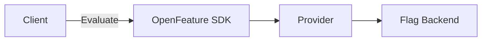

# OpenFeature Presentation Style Guide

A comprehensive guide for creating consistent, professional presentations for OpenFeature using Slidev.

## Table of Contents

- [Quick Start](#quick-start)
- [Color Palette](#color-palette)
- [Typography](#typography)
- [Layout Patterns](#layout-patterns)
- [Animation Guidelines](#animation-guidelines)
- [Component Library](#component-library)
- [Code Examples](#code-examples)
- [Best Practices](#best-practices)

## Quick Start

### Frontmatter Template

```yaml
---
theme: seriph
highlighter: shiki
css: unocss
colorSchema: dark
transition: fade-out
title: Your Presentation Title
exportFilename: your-export-name
lineNumbers: false
drawings:
  persist: false
fonts:
  sans: 'Inter'
  serif: 'Architects Daughter'
  mono: 'Fira Code'
mdc: true
preload: false
routerMode: hash
---
```

### Required Dependencies

```json
{
  "dependencies": {
    "@slidev/cli": "latest",
    "unocss": "latest",
    "@iconify-json/carbon": "latest",
    "@iconify-json/vscode-icons": "latest"
  }
}
```

## Color Palette

### Primary Colors

Use these colors for OpenFeature branding and key elements based on the [OpenFeature Branding Guidelines](https://openfeature.dev/community/branding-guidelines):

```css
/* Purple - Primary brand color */
.text-purple-500 { color: #8D8DFF; }
.text-purple-600 { color: #5D5DFF; }
.text-purple-700 { color: #4B4ACF; }

/* Blue - Secondary/accent */
.text-blue-400 { color: #ABABFF; }
.text-blue-500 { color: #6B7DFF; }

/* Green - Success/positive */
.text-green-400 { color: #4ADE80; }
.text-green-500 { color: #22C55E; }
```

### Semantic Colors

```css
/* Warning/attention */
.text-orange-500 { color: #FB923C; }
.text-amber-300 { color: #FCD34D; }

/* Error/critical */
.text-red-500 { color: #EF4444; }
.text-red-400 { color: #F87171; }

/* Neutral grays (from uno.config.ts) */
.text-gray-400 { color: #9BA9B4; }
.text-gray-500 { color: #707D86; }
.text-gray-600 { color: #55595F; }
```

### Usage Examples

```md
<!-- Highlight OpenFeature brand -->
<span text-purple-500>OpenFeature</span>

<!-- Show success states -->
<div text-green-400>✓ Evaluation successful</div>

<!-- Indicate warnings -->
<div text-orange-500>⚠ Configuration required</div>
```

## Typography

### Headings

```md
# Main Title (text-6xl, font-bold)
## Section Header (text-5xl)
### Subsection (text-4xl)
```

### Body Text Sizes

```css
.text-xl    /* 1.25rem - Large body text */
.text-2xl   /* 1.5rem - Emphasis text */
.text-3xl   /* 2rem - Small headings */
```

### Font Families

```css
font-sans    /* Inter - Default sans-serif */
font-serif   /* Architects Daughter - Handwritten style for notes */
font-mono    /* Fira Code - Code blocks */
```

### Text Styling Patterns

```md
<!-- Emphasized technical terms -->
<span text-cyan-400>feature flags</span>

<!-- Muted secondary information -->
<span opacity-70>Additional context</span>

<!-- Code-like inline text -->
<code>evaluationContext</code>

<!-- Handwritten emphasis -->
<span class="font-serif">"What Changed"</span>
```

## Layout Patterns

### Center Layout

For title slides and single-concept slides:

```md
---
layout: center
class: text-center
---

# Your Title

Subtitle or tagline
```

### Intro Layout

For speaker introductions and profiles:

```md
---
layout: intro
class: px-35
---

<div flex>
  <div
    w-120 h-120 rounded-full bg-cover bg-center
    style="background-image: url('/speaker.png');"
  />
  <div flex flex-col justify-center pl-10>
    <h1>Speaker Name</h1>
    <p>Title & Company</p>
  </div>
</div>
```

### Two-Column Layout

For comparisons and before/after scenarios:

```md
---
layout: two-cols
---

# Left Column

Content here

::right::

# Right Column

Content here
```

### Custom Grid Layouts

```md
<div grid grid-cols-2 gap-6>
  <div>Column 1</div>
  <div>Column 2</div>
</div>

<div grid grid-cols-3 gap-4>
  <div>Column 1</div>
  <div>Column 2</div>
  <div>Column 3</div>
</div>
```

### Section Divider

```md
---
layout: section
---

# New Section Title
```

## Animation Guidelines

### Progressive Disclosure with v-click

```md
<v-clicks>

- First point appears
- Second point appears
- Third point appears

</v-clicks>
```

### Synchronized Reveals

```md
<div v-click>First element</div>
<div v-after>Appears with first</div>
<div v-after>Also appears with first</div>
```

### Absolute Positioning

```md
<div v-click="3">Appears on third click</div>
<div v-click="1">Appears on first click</div>
<div v-click="2">Appears on second click</div>
```

### Transitions with Motion

```md
<div
  v-motion
  :initial="{ x: -80, opacity: 0 }"
  :enter="{ x: 0, opacity: 1, transition: { duration: 500 } }"
>
  Animated content
</div>
```

### Click-Controlled State Changes

```md
<div
  :class="$clicks < 2 ? 'opacity-0 scale-90' : 'opacity-100 scale-100'"
  transition duration-500
>
  Content that fades in and scales
</div>
```

### Visual Markup

Use `v-mark` for emphasis:

```md
<span v-mark="{ type: 'circle' }">circled text</span>
<span v-mark="{ type: 'crossed-off', color: 'red' }">crossed out</span>
<span v-mark="{ type: 'underline', color: 'green' }">underlined</span>
```

## Component Library

### Card Component

```md
<div border="2 solid white/5" rounded-lg overflow-hidden bg="white/5" backdrop-blur-sm>
  <div flex items-center bg="white/10" backdrop-blur px-3 py-2>
    <div i-carbon:idea text-blue-300 text-sm mr-2 />
    <span font-bold>Card Title</span>
  </div>
  <div px-4 py-3>
    Card content goes here
  </div>
</div>
```

### Info Box

```md
<div bg="blue-900/30" border="2 solid blue-800" rounded-lg px-5 py-3>
  <div flex items-center gap-2>
    <div i-carbon:information text-blue-300 text-xl />
    <span>Information message</span>
  </div>
</div>
```

### Warning Box

```md
<div bg="orange-900/30" border="2 solid orange-800" rounded-lg px-5 py-3>
  <div flex items-center gap-2>
    <div i-carbon:warning text-orange-300 text-xl />
    <span>Warning message</span>
  </div>
</div>
```

### Success Box

```md
<div bg="green-900/30" border="2 solid green-800" rounded-lg px-5 py-3>
  <div flex items-center gap-2>
    <div i-carbon:checkmark text-green-300 text-xl />
    <span>Success message</span>
  </div>
</div>
```

### Error Box

```md
<div bg="red-900/30" border="2 solid red-800" rounded-lg px-5 py-3>
  <div flex items-center gap-2>
    <div i-carbon:error text-red-300 text-xl />
    <span>Error message</span>
  </div>
</div>
```

## Code Examples

### Basic Code Block

````md
```typescript
import { OpenFeature } from '@openfeature/server-sdk';

const client = OpenFeature.getClient();
const value = await client.getBooleanValue('my-flag', false);
```
````

### With Line Highlighting

````md
```typescript {2,4-5}
import { OpenFeature } from '@openfeature/server-sdk';
import { FlagdProvider } from '@openfeature/flagd-provider';

await OpenFeature.setProvider(new FlagdProvider());
const client = OpenFeature.getClient();
```
````

### Progressive Highlighting

````md
```typescript {all|1|3-4|6}
import { OpenFeature } from '@openfeature/server-sdk';

const context = { userId: '123', tier: 'premium' };

const value = await client.getBooleanValue(
  'new-feature',
  false,
  context
);
```
````

### Code Groups with Icons

````md
::code-group

```typescript [Node.js ~i-vscode-icons:file-type-node~]
import { OpenFeature } from '@openfeature/server-sdk';
```

```java [Java ~i-vscode-icons:file-type-java~]
import dev.openfeature.sdk.OpenFeatureAPI;
```

```python [Python ~i-vscode-icons:file-type-python~]
from openfeature import api
```

::
````

### YAML Examples

````md
```yaml
apiVersion: core.openfeature.dev/v1beta1
kind: FeatureFlag
metadata:
  name: my-feature
spec:
  flagSpec:
    flags:
      my-flag:
        state: ENABLED
        defaultVariant: "on"
```
````

### Mermaid Diagrams

````md

````

## Best Practices

### Content Structure

1. **Start with Context**: Begin presentations with the problem statement
2. **Progressive Complexity**: Introduce concepts gradually
3. **Visual Hierarchy**: Use size, color, and spacing to guide attention
4. **Consistent Pacing**: Aim for 1-2 minutes per slide

### Animation Timing

```md
<!-- Good: Reveals support narrative flow -->
<v-clicks>
- Problem: Manual feature management
- Solution: Standardized evaluation
- Benefit: Vendor-agnostic switching
</v-clicks>

<!-- Avoid: Too many simultaneous animations -->
```

### Color Usage

```md
<!-- Good: Consistent semantic meaning -->
<span text-green-400>Enabled</span>
<span text-red-400>Disabled</span>

<!-- Avoid: Random color choices -->
<span text-pink-300>Enabled</span>
<span text-cyan-500>Disabled</span>
```

### Code Presentation

````md
<!-- Good: Show only relevant code -->
```typescript
const value = await client.getBooleanValue('flag-key', false);
```

<!-- Avoid: Overwhelming detail -->
```typescript
import { OpenFeature, Client, EvaluationContext, Provider } from '@openfeature/server-sdk';
import { FlagdProvider } from '@openfeature/flagd-provider';

const provider: Provider = new FlagdProvider({
  host: 'localhost',
  port: 8013,
  tls: false,
  // ... many more options
});

await OpenFeature.setProviderAndWait(provider);
const client: Client = OpenFeature.getClient();
// ... etc
```
````

### Accessibility

```md
<!-- Use descriptive alt text for images -->


<!-- Ensure sufficient color contrast -->
<div bg="white/10" text="white"> <!-- Good contrast -->
<div bg="white/5" text="gray-300"> <!-- Poor contrast -->
```

### Speaker Notes

```md
---
layout: center
---

# Your Slide Content

<!--
Add speaker notes here to guide your presentation.
These notes are only visible in presenter mode.
-->
```

### Spacing Utilities

```md
<!-- Vertical spacing -->
<div mt-6 />  <!-- margin-top: 1.5rem -->
<div mt-8 />  <!-- margin-top: 2rem -->
<div mt-12 /> <!-- margin-top: 3rem -->

<!-- Gap in flex/grid -->
<div flex gap-4>  <!-- gap: 1rem -->
<div grid gap-6>  <!-- gap: 1.5rem -->
```

## Common Patterns

### Feature Comparison

```md
<div grid grid-cols-2 gap-6>
  <div border="2 solid red-800/50" rounded-lg>
    <div bg="red-800/30" px-4 py-2>❌ Without OpenFeature</div>
    <div px-4 py-3>
      - Vendor lock-in
      - Custom integrations
      - Inconsistent APIs
    </div>
  </div>
  
  <div border="2 solid green-800/50" rounded-lg>
    <div bg="green-800/30" px-4 py-2>✓ With OpenFeature</div>
    <div px-4 py-3>
      - Vendor-agnostic
      - Standard SDK
      - Consistent evaluation
    </div>
  </div>
</div>
```

### Timeline/Process Flow

```md
<div flex items-center gap-4>
  <v-clicks>
    <div flex flex-col items-center>
      <div i-carbon:user text-4xl text-blue-400 />
      <span mt-2>Developer</span>
    </div>
    <div i-carbon:arrow-right text-2xl />
    <div flex flex-col items-center>
      <div i-carbon:sdk text-4xl text-purple-400 />
      <span mt-2>SDK</span>
    </div>
    <div i-carbon:arrow-right text-2xl />
    <div flex flex-col items-center>
      <div i-carbon:cloud text-4xl text-green-400 />
      <span mt-2>Provider</span>
    </div>
  </v-clicks>
</div>
```

### Key Takeaway

```md
<div v-click mt-6 flex justify-center>
  <div
    border="2 solid white/5" bg="white/5" backdrop-blur-sm
    rounded-lg px-6 py-3 flex items-center gap-3
  >
    <div i-carbon:idea text-yellow-300 text-2xl />
    <span text-lg>Key insight or takeaway message</span>
  </div>
</div>
```

### Speaker Profile

```md
<div flex items-center gap-6>
  
  <div>
    <h3 text-2xl font-bold>Speaker Name</h3>
    <p text-xl opacity-80>Role @ Company</p>
    <p text-lg opacity-70 mt-2>
      <span i-carbon:logo-github /> github.com/username
    </p>
  </div>
</div>
```

### Footer with Logo

```md
<div w-full absolute bottom-0 left-0 flex items-center transform="translate-x--10 translate-y--10">
  <div w-full flex items-center justify-end gap-4>
    
  </div>
</div>
```

## File Organization

```
presentation/
├── slides.md              # Main presentation content
├── components/            # Custom Vue components
│   └── CustomComponent.vue
├── pages/                # Additional slide pages
│   └── imported-slides.md
├── public/               # Static assets
│   ├── images/
│   └── logos/
├── snippets/             # Reusable code examples
│   └── examples.ts
├── uno.config.ts         # UnoCSS configuration
├── style.css             # Global styles
├── global-bottom.vue     # Global bottom component
├── package.json          # Dependencies
├── STYLES.md            # This style guide
├── NARRATIVE.md         # Presentation timing and flow
└── README.md            # Presentation notes
```

## Exporting

```bash
# Development preview
pnpm dev

# Build for production
pnpm build

# Export to PDF
pnpm export

# Export with custom name
pnpm export --output my-presentation.pdf
```

## Resources

- [Slidev Documentation](https://sli.dev)
- [OpenFeature Branding Guidelines](https://openfeature.dev/community/branding-guidelines)
- [UnoCSS Documentation](https://unocss.dev)
- [Carbon Icons](https://icon-sets.iconify.design/carbon/)

---

**Remember**: Consistency is key. Use this style guide to maintain a professional, cohesive look across all OpenFeature presentations.
