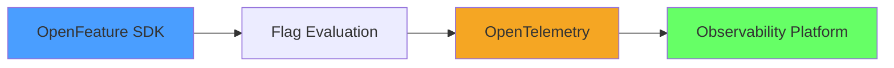

# Experiment with sli.dev

Testing features

---
clicks: 3
---

# Test Mermaid Animations

---
layout: center
---

# slidev-addon-qrcode

<QRCode
    :width="300"
    :height="300"
    type="svg"
    data="https://openfeature.dev"
    :margin="10"
    :imageOptions="{ margin: 10 }"
    :dotsOptions="{ type: 'rounded', color: 'rgb(221 221 221 / var(--un-text-opacity))' }"
/>

---

# Arrows!

<code data-id="anchor3" absolute left-460px top-180px>data-id=anchor3</code>
<code data-id="anchor4" absolute left-460px top-260px>data-id=anchor4</code>
<FancyArrow v-click
    from="[data-id=anchor3]@bottom"
    to="[data-id=anchor4]@top"
/>

<!-- 
Addon info: https://github.com/whitphx/slidev-addon-fancy-arrow
-->

---
clicks: 1
layout: center
---

# Service Failure Rate Monitor

  <Charts class="bg-white rounded-lg shadow-2xl p-6" />

<Transition name="fade">
  

    ⚠️ Incident Detected: Failure Rate Spike!
  

</Transition>

---

