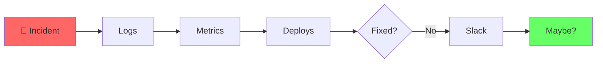
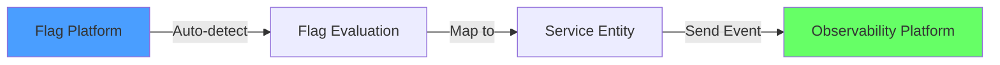
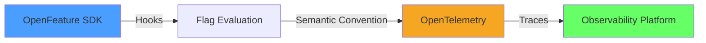
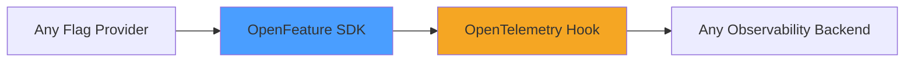
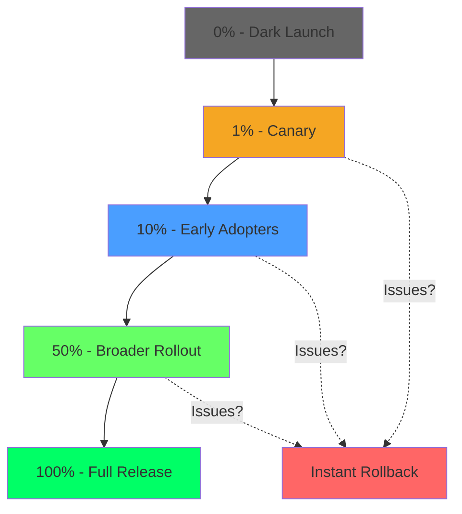

# From "What Broke" to "What Changed"

## Feature Flags as First-Class Signals in Observability

<div class="pt-12">
  <span class="px-2 py-1 rounded cursor-pointer opacity-80 hover:opacity-100">
    KubeCon + CloudNativeCon 2025
  </span>
</div>

<div class="abs-br m-6 flex gap-2">
  <span>25 Minutes</span>
  <span>|</span>
  <span>2 Speakers</span>
</div>

<!--
Welcome everyone! Today we're going to talk about a critical gap in modern observability - feature flags.
-->

---
layout: center
class: text-center
---

# Imagine This...

<v-clicks>

<div class="text-2xl mb-8">
🚨 Your monitoring dashboards are <span class="text-red-500 font-bold">flashing red</span>
</div>

<div class="text-xl mb-8">
📈 Error rates have <span class="text-red-500 font-bold">skyrocketed</span>
</div>

<div class="text-xl mb-8">
⏰ Your team has spent <span class="text-orange-500 font-bold">hours</span> digging through code
</div>

<div class="text-2xl mt-12">
Hours later, you discover... <span v-click class="text-blue-400 font-bold">it wasn't a bug</span>
</div>

<div v-after class="text-3xl mt-8 text-blue-400 font-bold">
It was a feature flag change 🚩
</div>

</v-clicks>

<!--
[IMAGE PLACEHOLDER: Chaotic monitoring dashboard showing red alerts, spike in errors, and elevated latency graphs]
This scenario plays out in engineering teams every day. Let's talk about why.
-->

---
layout: center
---

# The Problem

<div class="text-center text-2xl leading-relaxed mt-16">
<v-click>

Feature flags are **hidden** from observability tools

</v-click>
<v-click>

making it **difficult** to pinpoint changes

</v-click>
<v-click>

as the **root cause** of incidents

</v-click>
</div>

<div v-click class="mt-16 text-center opacity-70">
[IMAGE PLACEHOLDER: Simple diagram showing a feature flag toggle leading to error spike]
</div>

<!--
This is the core problem we're solving today. Feature flags operate in the shadows.
-->

---
layout: two-cols
---

# What Are Feature Flags?

<v-clicks>

- 🎛️ Toggle features **on/off** without deploying code

- 🚀 Used for **releases** and rollouts

- 🧪 Enable **A/B testing** and experiments

- 🔐 Control **permissions** and access

- 🎯 Target specific **user segments**

</v-clicks>

::right::

<div v-click class="mt-8">

```typescript {all|3|4-6|8-10|all}
// Feature flag evaluation
const client = OpenFeature.getClient();

const showNewCheckout = await client.getBooleanValue(
  'new-checkout-flow',
  false
);

if (showNewCheckout) {
  return <NewCheckoutComponent />;
}
```

</div>

<div v-click class="mt-8 opacity-70 text-sm">
[IMAGE PLACEHOLDER: Diagram of feature flag toggle controlling feature rollout to users]
</div>

<!--
Feature flags are powerful - they let us deploy code that's dormant until we're ready.
-->

---
layout: center
---

# The Observability Gap

<div class="grid grid-cols-2 gap-8 mt-12">

<div v-click>
<h3 class="text-blue-400 mb-4">What We See</h3>

- ❌ Error rates spike
- ❌ Latency increases  
- ❌ Failed requests
- ❌ Resource exhaustion

<div class="mt-4 text-sm opacity-70">
Traditional metrics & traces
</div>
</div>

<div v-click>
<h3 class="text-red-400 mb-4">What's Hidden</h3>

- ⚠️ Which flag changed?
- ⚠️ When was it toggled?
- ⚠️ Who was affected?
- ⚠️ What variant was served?

<div class="mt-4 text-sm opacity-70">
Feature flag context
</div>
</div>

</div>

<div v-click class="mt-12 text-center opacity-70">
[IMAGE PLACEHOLDER: Screenshot of trace or dashboard with NO reference to feature flags]
</div>

<!--
Observability tools show us the symptoms, but not the cause when flags are involved.
-->

---
layout: default
---

# Real-World Example: OpenTelemetry Demo

<div class="grid grid-cols-2 gap-6 mt-4">

<div>

<v-clicks>

### The Scenario

A feature flag enables a **product recommendation** feature

The feature has a **hidden performance bug**

Users experience:
- 🐌 Slow page loads
- ⏰ Request timeouts
- 💥 Increased errors

</v-clicks>

</div>

<div v-click>

### What Teams See

```yaml
# Dashboard
metrics:
  - response_time: ⬆️ 3000ms (150ms)
  - error_rate: ⬆️ 15% (0.1%)
  - timeouts: ⬆️ 40%

traces:
  - status: ERROR
  - duration: 5000ms
  - span: recommendation_service
```

<div class="mt-2 text-red-400 text-sm">
❓ No indication of feature flag involvement
</div>

</div>

</div>

<div v-click class="mt-4 text-center opacity-70 text-sm">
[IMAGE PLACEHOLDER: OTel Demo dashboard showing error spike]
</div>

<!--
In the OTel demo, we can simulate this exact scenario. The problem is invisible.
-->

---
layout: center
---

# Why This Matters

<div class="grid grid-cols-3 gap-8 mt-12">

<div v-click class="text-center">
<div class="text-4xl mb-4">⏱️</div>
<div class="text-xl font-bold mb-2">Longer MTTR</div>
<div class="text-sm opacity-70">Mean Time to Recovery increases when root cause is hidden</div>
</div>

<div v-click class="text-center">
<div class="text-4xl mb-4">💸</div>
<div class="text-xl font-bold mb-2">Wasted Time</div>
<div class="text-sm opacity-70">Engineers spend hours debugging code that isn't broken</div>
</div>

<div v-click class="text-center">
<div class="text-4xl mb-4">😰</div>
<div class="text-xl font-bold mb-2">All-Hands Incidents</div>
<div class="text-sm opacity-70">What should be a quick rollback becomes a major incident</div>
</div>

</div>

<div v-click class="mt-12 text-center opacity-70">
[IMAGE PLACEHOLDER: Timeline comparing MTTR with vs without feature flag observability]
</div>

<!--
The impact is real - longer incidents, wasted engineering time, and unnecessary stress.
-->

---
layout: section
---

# The Evolution of Feature Flag Observability

How teams have tried to solve this problem

---
layout: center
---

# Stage 1: Flying Blind 🙈

<div class="grid grid-cols-2 gap-8 mt-6">

<div v-click>

### The Reality

- No visibility into flag state
- Manual correlation attempts
- Guesswork during incidents
- Slow troubleshooting

</div>

<div v-click>

### The Process



<div class="text-xs mt-2 opacity-70">
Manual hunt through logs, metrics, deploys, and Slack
</div>

</div>

</div>

<div v-click class="mt-4 text-center opacity-70 text-sm">
[IMAGE PLACEHOLDER: Cartoon of blindfolded engineer at dashboard]
</div>

<!--
This is where most teams start. It's painful and inefficient.
-->

---
layout: default
---

# Stage 2: Manual Change Events

<div class="mt-4">

### The Improvement

<div v-click class="mb-4">
Send change events from feature flag platform → observability tool
</div>

<div class="grid grid-cols-2 gap-6 mt-4">

<div v-click>

```typescript {monaco-line-height:16}
// Manual event tracking
flagManager.on('flag.changed', (event) => {
  observability.recordEvent({
    type: 'feature_flag_change',
    flag: event.flagKey,
    oldValue: event.previousValue,
    newValue: event.currentValue,
    timestamp: Date.now()
  });
});
```

</div>

<div v-click>

### Limitations

- ❌ Manual setup per flag
- ❌ No trace correlation
- ❌ Difficult to scale
- ❌ No per-request impact
- ❌ Error-prone config

</div>

</div>

</div>

<div v-click class="mt-4 text-center opacity-70 text-sm">
[IMAGE PLACEHOLDER: Manual event configuration UI]
</div>

<!--
Manual events are better than nothing, but they don't scale and lack granularity.
-->

---
layout: default
---

# Stage 3: Automatic Event Mapping

<div class="grid grid-cols-2 gap-6 mt-4">

<div>

### The Evolution

<div v-click>
Systems that **automatically** understand:
</div>

<v-clicks>

- Where flags are evaluated
- Which services are affected  
- Correct entity mapping
- Send events without manual work

</v-clicks>

</div>

<div v-click>



</div>

</div>

<div v-click class="mt-4">

### Still Missing

<div class="grid grid-cols-2 gap-3 mt-2">
<div class="border border-red-500 border-dashed p-3 rounded text-sm">
<span class="text-red-400">❌ Per-request visibility</span>
<div class="text-xs mt-1">Can't see which requests were affected</div>
</div>

<div class="border border-red-500 border-dashed p-3 rounded text-sm">
<span class="text-red-400">❌ Variant-level insights</span>
<div class="text-xs mt-1">Can't compare performance across variants</div>
</div>
</div>

</div>

<div v-click class="mt-4 text-center opacity-70 text-sm">
[IMAGE PLACEHOLDER: Automatic event mapping flowchart]
</div>

<!--
Automatic mapping is better, but we need trace-level observability for the full picture.
-->

---
layout: center
class: text-center
---

# Stage 4: Trace-Level Observability 🎯

<div class="text-2xl mt-8 mb-8">
The **Gold Standard**
</div>

<v-clicks>

<div class="text-xl mb-4">
🔍 See flag evaluations in **every trace**
</div>

<div class="text-xl mb-4">
📊 Slice and dice by **flag** and **variant**
</div>

<div class="text-xl mb-4">
⚡ **Instantly** correlate flags to request performance
</div>

<div class="text-xl mb-4">
🎚️ Compare variants in **real-time**
</div>

</v-clicks>

<div v-click class="mt-12 text-center opacity-70">
[IMAGE PLACEHOLDER: Annotated screenshot showing trace with feature flag attributes highlighted]
</div>

<!--
This is what we're building towards - flags as first-class citizens in observability.
-->

---
layout: default
---

# Trace-Level Example

<div class="grid grid-cols-2 gap-8 mt-8">

<div>

### Traditional Trace

```yaml
trace_id: abc123
spans:
  - name: checkout_service
    duration: 5000ms
    status: ERROR
    attributes:
      http.method: POST
      http.status_code: 500
```

<div v-click class="mt-4 text-red-400">
❓ Why did this fail?
</div>

</div>

<div v-click>

### With Flag Observability

```yaml {all|7-11|all}
trace_id: abc123
spans:
  - name: checkout_service
    duration: 5000ms
    status: ERROR
    attributes:
      feature_flag.key: new-payment-processor
      feature_flag.variant: treatment
      feature_flag.provider_name: flagd
      feature_flag.context.user_id: user_456
      feature_flag.context.tier: premium
      http.method: POST
      http.status_code: 500
```

<div v-click class="mt-4 text-green-400">
✅ Flag variant "treatment" caused the error!
</div>

</div>

</div>

<!--
With trace-level data, the root cause becomes immediately obvious.
-->

---
layout: center
---

# Key Takeaway

<div class="text-3xl text-center mt-16 leading-relaxed">

Trace-level observability makes feature flags

<span class="text-blue-400 font-bold">first-class citizens</span>

in your monitoring stack

</div>

<div v-click class="mt-16 text-xl text-center opacity-80">
No more guessing. No more manual correlation.
</div>

<!--
This is the transformation we're enabling with OpenFeature and OpenTelemetry.
-->

---
layout: section
---

# Feature Flag Observability Standards

How OpenFeature & OpenTelemetry defined the solution

---
layout: default
---

# Collaboration: OpenFeature ❤️ OpenTelemetry

<div class="grid grid-cols-2 gap-8 mt-8">

<div v-click>

### OpenFeature

- 🚩 Open standard for **feature flagging**
- 🔌 Vendor-neutral SDK
- 🎣 **Hook system** for extensibility
- 🌐 Multi-language support

</div>

<div v-click>

### OpenTelemetry

- 📊 Open standard for **observability**
- 📈 Metrics, traces, and logs
- 🏷️ **Semantic conventions** for consistency
- 🔗 End-to-end visibility

</div>

</div>

<div v-click class="mt-8 text-center">



</div>

<div v-click class="mt-4 text-center opacity-70 text-sm">
[IMAGE PLACEHOLDER: OpenFeature and OpenTelemetry logos]
</div>

<!--
Two communities came together to solve this problem with open standards.
-->

---
layout: default
---

# Anatomy of a Feature Flag Evaluation

### What We Track

<div class="grid grid-cols-2 gap-6 mt-4">

<div v-click>

#### Core Attributes

```yaml
feature_flag.key: "new-checkout"
feature_flag.variant: "treatment"
feature_flag.provider_name: "flagd"
```

</div>

<div v-click>

#### Context Data

```yaml
feature_flag.context.user_id: "user_123"
feature_flag.context.environment: "prod"
feature_flag.context.tier: "premium"
```

</div>

</div>

<div v-click class="mt-4">

#### Full Evaluation Event

```json {*|2-3|4-5|6-11|*}{at:3}
{
  "timestamp": "2025-10-10T14:30:00Z",
  "event_type": "feature_flag_evaluation",
  "trace_id": "abc123",
  "span_id": "def456",
  "attributes": {
    "feature_flag.key": "new-checkout",
    "feature_flag.variant": "treatment",
    "feature_flag.provider_name": "flagd",
    "feature_flag.context.user_id": "user_123"
  }
}
```

</div>

<div v-click class="mt-2 text-center opacity-70 text-sm">
[IMAGE PLACEHOLDER: Diagram breaking down flag evaluation]
</div>

<!--
These attributes give us everything we need to correlate flags with outcomes.
-->

---
layout: default
---

# How It Works: OpenFeature Hooks

```typescript {all|1-3|5-7|9-16|18-24|all}
import { OpenFeature } from '@openfeature/server-sdk';
import { OtelHook } from '@openfeature/otel-hook';

// Register the OpenTelemetry hook
OpenFeature.addHooks(new OtelHook());
const client = OpenFeature.getClient();

// Prepare evaluation context
const context = {
  targetingKey: 'user_123',
  tier: 'premium',
  environment: 'production'
};

// Evaluate flag - automatically traced!
const variant = await client.getStringValue(
  'new-checkout-flow',
  'control',
  context
);

// Flag evaluation is now in the trace with attributes:
//   - feature_flag.key: "new-checkout-flow"
//   - feature_flag.variant: "treatment"
//   - feature_flag.context.tier: "premium"
```

<!--
The hook system makes this seamless - no manual instrumentation needed.
-->

---
layout: default
---

# Flag Evaluation in a Trace

### Distributed Trace View

```yaml {all|3-6|8-14|16-21|all}
Trace ID: 7f8a9b2c3d4e5f6a

Frontend Service (120ms)
  ├─ GET /checkout
  ├─ feature_flag.key: "new-checkout-flow"
  └─ feature_flag.variant: "treatment"

Checkout Service (890ms)
  ├─ POST /api/checkout
  ├─ feature_flag.key: "payment-processor-v2"
  ├─ feature_flag.variant: "enabled"
  ├─ feature_flag.context.user_id: "user_123"
  └─ feature_flag.context.tier: "premium"

Payment Service (2500ms) ⚠️
  ├─ POST /process-payment
  ├─ feature_flag.key: "payment-processor-v2"
  ├─ feature_flag.variant: "enabled"
  ├─ status: ERROR
  └─ error: "Connection timeout to payment gateway"
```

<div v-click class="mt-4 p-3 bg-blue-900 bg-opacity-30 rounded text-sm">
<span class="text-blue-400">✨ Insight:</span> The "payment-processor-v2" flag's "enabled" variant correlates with the timeout error
</div>

<div v-click class="mt-2 text-center opacity-70 text-sm">
[IMAGE PLACEHOLDER: Visual trace waterfall with flag attributes]
</div>

<!--
Now we can see exactly which flags contributed to the failure, across services.
-->

---
layout: center
---

# Why Standards Matter

<div class="grid grid-cols-3 gap-8 mt-8">

<div v-click class="text-center">
<div class="text-4xl mb-4">🔄</div>
<div class="text-xl font-bold mb-2">Interoperability</div>
<div class="text-sm opacity-70">Works across vendors and tools</div>
</div>

<div v-click class="text-center">
<div class="text-4xl mb-4">📈</div>
<div class="text-xl font-bold mb-2">Consistency</div>
<div class="text-sm opacity-70">Same attributes everywhere</div>
</div>

<div v-click class="text-center">
<div class="text-4xl mb-4">🚀</div>
<div class="text-xl font-bold mb-2">Adoption</div>
<div class="text-sm opacity-70">Easy to implement and adopt</div>
</div>

</div>

<div v-click class="mt-12">



</div>

<div v-click class="mt-6 text-center opacity-70 text-sm">
[IMAGE PLACEHOLDER: Interoperability diagram]
</div>

<!--
Standards enable an ecosystem where everything works together seamlessly.
-->

---
layout: section
---

# Progressive Delivery with Observability

Transforming theory into practice

---
layout: default
---

# What Is Progressive Delivery?

<div class="grid grid-cols-2 gap-8 mt-6">

<div>

### The Concept

<v-clicks>

- Gradually expose customers to new features
- Monitor impact at each step
- Roll back instantly if problems arise
- Minimize risk, maximize confidence

</v-clicks>

</div>

<div v-click>

### Rollout Stages



</div>

</div>

<div v-click class="mt-4 text-center opacity-70 text-sm">
[IMAGE PLACEHOLDER: Visual diagram of gradual rollout percentages]
</div>

<!--
Progressive delivery is the new standard for feature releases, but it requires observability.
-->

---
layout: default
---

# Observability Enables Progressive Delivery

### The Feedback Loop

```typescript {all|1-5|7-13|15-19|21-25|all}
// 1. Start rollout at 1%
await flagProvider.updateRollout('new-feature', {
  percentage: 1,
  targeting: { tier: 'internal' }
});

// 2. Monitor observability data
const metrics = await observability.query({
  feature_flag_key: 'new-feature',
  feature_flag_variant: 'enabled',
  timeRange: 'last_30m'
});

if (metrics.errorRate > 0.5) {
  // Problem detected! Rollback
  await flagProvider.updateRollout('new-feature', { percentage: 0 });
  alert('Rollback triggered - error rate exceeded threshold');
}

// 3. Gradually increase if healthy
if (metrics.errorRate < 0.1 && metrics.p95Latency < 500) {
  await flagProvider.updateRollout('new-feature', { percentage: 10 });
  console.log('Rollout increased to 10%');
}

// 4. Compare variants
const comparison = await observability.compare({
  variant_a: 'control', variant_b: 'enabled', metric: 'conversion_rate'
});
```

<!--
With flag observability, progressive delivery becomes automated and data-driven.
-->

---
layout: default
---

# Real Example: OpenTelemetry Demo App

<div class="grid grid-cols-2 gap-6 mt-4">

<div>

### The Scenario

<div v-click class="text-sm">
New product recommendation algorithm with unknown performance impact
</div>

<div v-click class="mt-4">

### Rollout Plan

1. **0%** - Dark launch
2. **1%** - Internal users
3. **5%** - Monitor 24hrs
4. **25%** - Expand gradually
5. **100%** - Full rollout

</div>

</div>

<div v-click>

### Monitoring Dashboard

```yaml
# At 5% rollout
Variant: recommendation-v2

Error Rate:
  Control:   0.1%
  Treatment: 0.12% ✅

P95 Latency:
  Control:   145ms
  Treatment: 168ms ⚠️

Conversion:
  Control:   2.3%
  Treatment: 3.1% 🎉 +34%
```

<div v-click class="mt-2 p-2 bg-green-900 bg-opacity-30 rounded text-sm">
<span class="text-green-400">Decision:</span> Continue - conversion gains outweigh latency
</div>

</div>

</div>

<div v-click class="mt-2 text-center opacity-70 text-sm">
[IMAGE PLACEHOLDER: OTel Demo controlled rollout dashboard]
</div>

<!--
Real-time observability data drives rollout decisions with confidence.
-->

---
layout: center
---

# Key Benefits

<div class="grid grid-cols-2 gap-12 mt-12">

<div v-click>

### Without Flag Observability

- ❌ Blind rollouts
- ❌ Slow to detect issues
- ❌ Manual rollback decisions
- ❌ Can't compare variants
- ❌ High-risk deployments

</div>

<div v-click>

### With Flag Observability

- ✅ Data-driven rollouts
- ✅ Instant issue detection
- ✅ Automated rollback triggers
- ✅ Real-time variant comparison
- ✅ Low-risk deployments

</div>

</div>

<div v-click class="mt-16 text-center text-2xl">
Feature flag observability transforms progressive delivery from <span class="text-red-400">theory</span> to <span class="text-green-400">practice</span>
</div>

<!--
This is the power of combining feature flags with observability.
-->

---
layout: section
---

# Call to Action

Join us in building the future of observability

---
layout: default
---

# 1. Contribute to the Standards

<div class="grid grid-cols-2 gap-6 mt-4">

<div>

### OpenTelemetry Semantic Convention

<v-clicks>

- Help expand the feature flag spec
- Add new attributes and use cases
- Review and provide feedback

</v-clicks>

<div v-click class="mt-3">

```bash
# Clone the repo
git clone https://github.com/\
  open-telemetry/semantic-conventions

cd semantic-conventions
```

</div>

</div>

<div v-click>

### OpenFeature

<v-clicks>

- Implement hooks for new platforms
- Add provider integrations
- Share your use cases

</v-clicks>

<div v-click class="mt-3">

```bash
# Explore OpenFeature
git clone https://github.com/\
  open-feature/spec

cd spec
```

</div>

</div>

</div>

<div v-click class="mt-4 text-center">

<div class="inline-flex gap-3 text-sm">
<div class="px-3 py-2 bg-blue-900 bg-opacity-40 rounded">
🔗 github.com/open-telemetry/semantic-conventions
</div>
<div class="px-3 py-2 bg-blue-900 bg-opacity-40 rounded">
🔗 github.com/open-feature/spec
</div>
</div>

</div>

<div v-click class="mt-2 text-center opacity-70 text-sm">
[IMAGE PLACEHOLDER: GitHub repos with contribution guidelines]
</div>

<!--
The standards are evolving - your input shapes the future.
-->

---
layout: default
---

# 2. Adopt in Your Workflow

### Getting Started

<div class="grid grid-cols-2 gap-6 mt-4">

<div v-click>

**Step 1: Install**

```bash
npm install @openfeature/server-sdk
npm install @openfeature/otel-hook
```

</div>

<div v-click>

**Step 2: Configure Provider**

```typescript
import { OpenFeature } from '@openfeature/server-sdk';
import { FlagdProvider } from '@openfeature/flagd-provider';

await OpenFeature.setProvider(
  new FlagdProvider()
);
```

</div>

</div>

<div v-click class="mt-4">

**Step 3: Add OpenTelemetry Hook**

```typescript {all|1-2|4-5|7-12|all}
import { OtelHook } from '@openfeature/otel-hook';
import { trace } from '@opentelemetry/api';

// Register the hook globally
OpenFeature.addHooks(new OtelHook());

// Now all flag evaluations are automatically traced!
const client = OpenFeature.getClient();
const showNewFeature = await client.getBooleanValue(
  'new-feature', false, { userId: 'user_123', tier: 'premium' }
);
// ✨ This evaluation is now visible in your traces
```

</div>

<div v-click class="mt-2 text-center opacity-70 text-sm">
[IMAGE PLACEHOLDER: Implementation guide]
</div>

<!--
Implementation is straightforward - just a few lines of code.
-->

---
layout: default
---

# 3. Try It Yourself

<div class="grid grid-cols-2 gap-6 mt-4">

<div>

### OpenTelemetry Demo App

<v-clicks>

- Fully instrumented reference app
- Feature flags + observability built-in
- See the integration in action

</v-clicks>

<div v-click class="mt-4">

```bash
# Clone and run the demo
git clone https://github.com/\
  open-telemetry/opentelemetry-demo

cd opentelemetry-demo
docker compose up

# Open the app
open http://localhost:8080
```

</div>

</div>

<div v-click>

### Experiment & Learn

<div class="space-y-3 text-sm">

<div class="p-3 bg-blue-900 bg-opacity-30 rounded">
🚩 Toggle feature flags in the UI
</div>

<div class="p-3 bg-blue-900 bg-opacity-30 rounded">
📊 See flag data in traces
</div>

<div class="p-3 bg-blue-900 bg-opacity-30 rounded">
🔍 Correlate flags to errors
</div>

<div class="p-3 bg-blue-900 bg-opacity-30 rounded">
📈 Compare variant performance
</div>

</div>

</div>

</div>

<div v-click class="mt-2 text-center opacity-70 text-sm">
[IMAGE PLACEHOLDER: OTel Demo app with feature flag UI]
</div>

<!--
The demo is the best way to see this in action and learn the patterns.
-->

---
layout: default
---

# 4. Share Your Feedback

<div class="grid grid-cols-3 gap-6 mt-8">

<div v-click class="text-center">

### 💬 Community

Join the conversation

<div class="mt-4 space-y-2 text-sm">
<div>CNCF Slack</div>
<div>#openfeature</div>
<div>#opentelemetry</div>
</div>

</div>

<div v-click class="text-center">

### 🐛 Issues

Report bugs & features

<div class="mt-4 space-y-2 text-sm">
<div>GitHub Issues</div>
<div>Feature requests</div>
<div>Bug reports</div>
</div>

</div>

<div v-click class="text-center">

### 📝 Blog

Share your experience

<div class="mt-4 space-y-2 text-sm">
<div>Use cases</div>
<div>Integration guides</div>
<div>Lessons learned</div>
</div>

</div>

</div>

<div v-click class="mt-8 text-center">

<div class="inline-flex gap-6 text-lg">
<div>🔗 openfeature.dev</div>
<div>🔗 opentelemetry.io</div>
</div>

</div>

<div v-click class="mt-6 text-center opacity-70 text-sm">
[IMAGE PLACEHOLDER: QR code to feedback form]
</div>

<!--
Your feedback helps us improve the standards and tooling for everyone.
-->

---
layout: center
class: text-center
---

# The Transformation

<div class="grid grid-cols-2 gap-16 mt-16 text-left">

<div v-click>

### Before

<div class="mt-6 space-y-4 text-lg">
<div>🔥 Firefighting incidents</div>
<div>❓ "What broke?"</div>
<div>⏰ Hours of debugging</div>
<div>😰 All-hands emergencies</div>
<div>🎲 Risky deployments</div>
</div>

</div>

<div v-click>

### After

<div class="mt-6 space-y-4 text-lg">
<div>📊 Proactive monitoring</div>
<div>✅ "What changed!"</div>
<div>⚡ Instant root cause</div>
<div>😌 Quick rollbacks</div>
<div>🚀 Confident deployments</div>
</div>

</div>

</div>

<div v-click class="mt-16 text-2xl">
From reactive to <span class="text-blue-400 font-bold">proactive</span> 
</div>

<div v-click class="mt-4 text-2xl">
From chaos to <span class="text-green-400 font-bold">confidence</span>
</div>

<!--
This is the future we're building together.
-->

---
layout: center
class: text-center
---

# Let's Build the Future Together

<div class="mt-16 text-xl leading-relaxed">

<v-click>

Feature flags are powerful tools for modern software delivery

</v-click>

<v-click>

But they need to be <span class="text-blue-400 font-bold">visible</span> in our observability stack

</v-click>

<v-click>

OpenFeature + OpenTelemetry make this possible with <span class="text-green-400 font-bold">open standards</span>

</v-click>

<v-click>

Join us in transforming how we understand and deploy software

</v-click>

</div>

<div v-click class="mt-16 text-3xl font-bold text-blue-400">
From "What broke?" to "What changed!"
</div>

<div v-click class="mt-8 text-center opacity-70">
[IMAGE PLACEHOLDER: Inspiring visual of a calm, well-monitored system with happy engineers]
</div>

<!--
Together, we can make feature flags first-class citizens in observability.
-->

---
layout: center
class: text-center
---

# Thank You! 🙏

<div class="mt-12 text-xl space-y-4">
<div>Questions?</div>
<div class="mt-8 opacity-80">Find us after the talk or online:</div>
</div>

<div class="mt-12 grid grid-cols-2 gap-8 text-left max-w-2xl mx-auto">

<div>

### Resources

- 🔗 openfeature.dev
- 🔗 opentelemetry.io
- 🔗 github.com/open-telemetry/opentelemetry-demo

</div>

<div>

### Connect

- 💬 CNCF Slack: #openfeature
- 💬 CNCF Slack: #opentelemetry
- 🐦 @openfeature / @opentelemetry

</div>

</div>

<div class="abs-br m-6 text-sm opacity-50">
Slides: [your-url-here]
</div>

<!--
Thank you all for your time! We're excited to work with you on this.
-->
