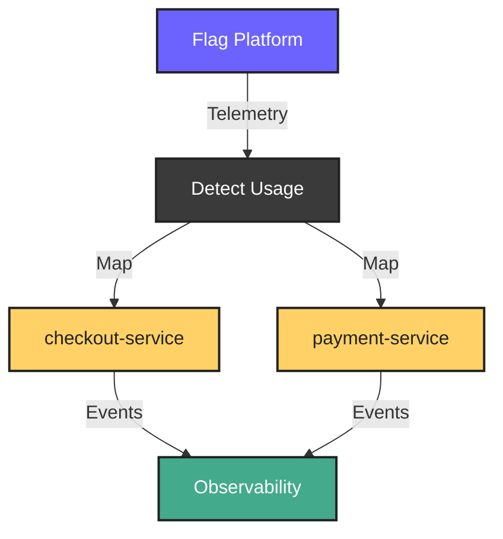
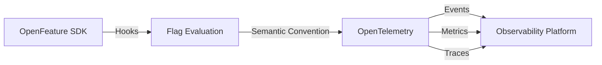
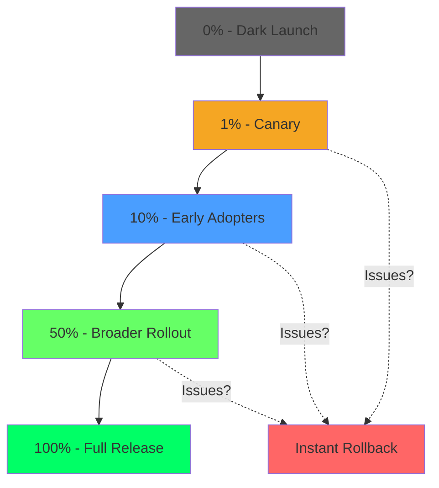

<div translate-x--14>
  <h1>
    From <span class="font-serif">"What Broke"</span> to <span class="font-serif">"What Changed"</span>
  </h1>

  <p>Michael Beemer, Dynatrace<br>Parth Suthar, DevCycle</p>
</div>

<div w-full absolute bottom-0 left-0 flex items-center transform="translate-x--10 translate-y--10">
  <div w-full flex items-center justify-end gap-4>
    
  </div>
</div>

<!--
Welcome everyone! Today we're going to talk about a critical gap in modern observability - feature flags.
-->

---
layout: intro
class: px-35
---

<div flex>
  <div
    v-click="1" flex flex-col items-center transition duration-500 ease-in-out
    :class="$clicks < 1 ? 'translate-y-20 opacity-0' : 'translate-y-0 opacity-100'"
  >
    
    <span font-semibold text-3xl >Michael Beemer</span>
    <div items-center>
      <div>
        <span class="opacity-70">Senior Product Manager</span>
      </div>
      <div text-sm flex items-center justify-center gap-2 mt-4>
        <div i-ri:github-fill /><span underline decoration-dashed font-mono decoration-zinc-300>beeme1mr</span>
      </div>
    </div>
  </div>
  <div flex-1 />
  <div
    v-click="2" flex flex-col items-center transition duration-500 ease-in-out
    :class="$clicks < 2 ? 'translate-y-20 opacity-0' : 'translate-y-0 opacity-100'"
  >
    
    <span font-semibold text-3xl>Parth Suthar</span>
    <div items-center>
      <div>
        <span class="opacity-70">Software engineer</span>
      </div>
      <div text-sm flex items-center justify-center gap-2 mt-4>
        <div i-ri:github-fill /><span underline decoration-dashed font-mono decoration-zinc-300>suthar26</span>
      </div>
    </div>
  </div>
</div>

---
layout: two-cols
class: px-6 py-4
---

<div class="pr-4">

# <span class="text-red-400">2:35 PM</span> Tuesday

<div class="text-xs opacity-70 mb-4">A familiar story...</div>

<IncidentTimeline :visible-items="$clicks" />

</div>

::right::

<div class="pl-4 pt-4">
  <ProblemCard 
    service-name="checkout-service"
    :error-rate="7.14"
    timestamp="Oct 15, 2025, 2:35 PM"
  />
  
  <div v-click="7" class="mt-3 p-2 bg-red-900/20 border border-red-500/30 rounded text-xs">
    <div class="font-bold text-red-400 mb-1">⚠️ The Missing Context</div>
    <div class="opacity-80">Feature flag changes are <span class="font-bold">invisible</span> to traditional monitoring</div>
  </div>
</div>

<!--
This is the reality for teams using feature flags without proper observability.
The problem card shows everything EXCEPT what actually changed - the feature flag.
This timeline plays out daily in engineering teams everywhere.
3+ hours wasted because the monitoring tool couldn't tell us about the flag change.
-->

---
layout: center
---

<div class="text-center text-3xl mt-12">

Feature flags are <span class="font-serif text-red-400">hidden</span> from observability tools

<v-click>

making it <span class="font-serif text-orange-400">difficult</span> to pinpoint changes

</v-click>
<v-click>

as the <span class="font-serif text-blue-400">root cause</span> of incidents

</v-click>

</div>

<!--
This is the core problem we're solving today. Feature flags operate in the shadows.
-->

---
class: py-10
hide: true
---

# What Are Feature Flags?

<span>Runtime configuration for modern software delivery</span>

<div mt-6 />

<div grid grid-cols-2 gap-6>

<div>
<v-clicks>

<div border="2 solid white/5" rounded-lg overflow-hidden bg="white/5" backdrop-blur-sm p-4 mb-3>
  <div flex items-center mb-2>
    <div i-carbon:settings-adjust text-blue-300 text-lg mr-2 />
    <span font-semibold>Toggle Control</span>
  </div>
  <div text-sm opacity-70>Turn features on/off without deploying code</div>
</div>

<div border="2 solid white/5" rounded-lg overflow-hidden bg="white/5" backdrop-blur-sm p-4 mb-3>
  <div flex items-center mb-2>
    <div i-carbon:rocket text-green-300 text-lg mr-2 />
    <span font-semibold>Progressive Rollouts</span>
  </div>
  <div text-sm opacity-70>Gradual releases and canary deployments</div>
</div>

<div border="2 solid white/5" rounded-lg overflow-hidden bg="white/5" backdrop-blur-sm p-4 mb-3>
  <div flex items-center mb-2>
    <div i-carbon:chart-multitype text-purple-300 text-lg mr-2 />
    <span font-semibold>A/B Testing</span>
  </div>
  <div text-sm opacity-70>Experiments and variant testing</div>
</div>

<div border="2 solid white/5" rounded-lg overflow-hidden bg="white/5" backdrop-blur-sm p-4 mb-3>
  <div flex items-center mb-2>
    <div i-carbon:user-access text-amber-300 text-lg mr-2 />
    <span font-semibold>Access Control</span>
  </div>
  <div text-sm opacity-70>Permissions and targeting rules</div>
</div>

</v-clicks>
</div>

<div v-click="5">

<div class="bg-white/5 backdrop-blur-sm border border-white/10 rounded-lg p-2">

```typescript
const client = OpenFeature.getClient();

const showNewCheckout = client.getBooleanValue(
  'new-checkout-flow',
  false
);

if (showNewCheckout) {
  return <NewCheckoutComponent />;
}
```

</div>

</div>

</div>

<!--
Feature flags are powerful - they let us deploy code that's dormant until we're ready.
-->

---
class: py-10
---

# The Observability Gap

<span>What traditional monitoring misses</span>

<div mt-8 />

<div grid grid-cols-2 gap-6>

<div v-click border="2 solid blue-500/30" rounded-lg overflow-hidden bg="blue-900/20" backdrop-blur-sm>
  <div flex items-center bg="blue-800/30" backdrop-blur px-4 py-3>
    <div i-carbon:view text-blue-300 text-xl mr-3 />
    <h3 class="text-blue-400 font-semibold text-lg">What We See</h3>
  </div>
  <div px-4 py-4>
    <div flex flex-col gap-3>
      <div flex items-center>
        <div i-carbon:warning-alt text-red-400 mr-2 />
        <span>Error rates spike</span>
      </div>
      <div flex items-center>
        <div i-carbon:time text-orange-400 mr-2 />
        <span>Latency increases</span>
      </div>
      <div flex items-center>
        <div i-carbon:close-filled text-red-400 mr-2 />
        <span>Failed requests</span>
      </div>
      <div flex items-center>
        <div i-carbon:chart-area text-purple-400 mr-2 />
        <span>Resource exhaustion</span>
      </div>
    </div>
    <div class="mt-4 text-sm opacity-70 italic">
      Traditional metrics & traces
    </div>
  </div>
</div>

<div v-click border="2 solid red-500/30" rounded-lg overflow-hidden bg="red-900/20" backdrop-blur-sm>
  <div flex items-center bg="red-800/30" backdrop-blur px-4 py-3>
    <div i-carbon:view-off text-red-300 text-xl mr-3 />
    <h3 class="text-red-400 font-semibold text-lg">What's Hidden</h3>
  </div>
  <div px-4 py-4>
    <div flex flex-col gap-3>
      <div flex items-center>
        <div i-carbon:flag text-amber-400 mr-2 />
        <span>Which flag changed?</span>
      </div>
      <div flex items-center>
        <div i-carbon:time text-amber-400 mr-2 />
        <span>When was it toggled?</span>
      </div>
      <div flex items-center>
        <div i-carbon:user text-amber-400 mr-2 />
        <span>Who was affected?</span>
      </div>
      <div flex items-center>
        <div i-carbon:branch text-amber-400 mr-2 />
        <span>What variant was served?</span>
      </div>
    </div>
    <div class="mt-4 text-sm opacity-70 italic">
      Feature flag context
    </div>
  </div>
</div>

</div>

<!-- <div v-click class="mt-6 text-center opacity-70">
[IMAGE PLACEHOLDER: Screenshot of trace or dashboard with NO reference to feature flags]
</div> -->

<!--
Observability tools show us the symptoms, but not the cause when flags are involved.
-->

---
class: py-10
---

# A Real-World Example: OpenTelemetry Demo

<span>Feature flags that trigger production-like issues</span>

<div class="grid grid-cols-2 gap-8 mt-6">

<div>

<v-clicks>

<div>

### Astronomy Shop

- Full **microservices e-commerce** platform
- 10+ services, multiple languages
- Production-grade observability stack
- Uses **OpenFeature** for feature flagging

</div>

<div class="mt-4 p-3 bg-purple-900/20 border border-purple-500/30 rounded">
<div class="text-sm font-semibold text-purple-300 mb-2">🎯 Perfect Test Bed</div>
<div class="text-xs opacity-80">
Includes flags that deliberately enable problems to demonstrate observability challenges
</div>
</div>

</v-clicks>

</div>

<div v-click>

### Problem Scenarios

<div class="mt-3 space-y-2">

<div class="p-3 bg-red-900/20 border border-red-500/30 rounded">
<div class="font-semibold text-sm mb-1 flex items-center">
<div i-carbon:warning-alt text-red-400 mr-2 />
<code class="text-xs">recommendationServiceCacheFailure</code>
</div>
<div class="text-xs opacity-70">Memory leak → 1.4x exponential growth → OOM crashes</div>
</div>

<div class="p-3 bg-orange-900/20 border border-orange-500/30 rounded">
<div class="font-semibold text-sm mb-1 flex items-center">
<div i-carbon:warning-alt text-orange-400 mr-2 />
<code class="text-xs">paymentServiceUnreachable</code>
</div>
<div class="text-xs opacity-70">Invalid endpoint → all payment requests fail</div>
</div>

<div class="p-3 bg-amber-900/20 border border-amber-500/30 rounded">
<div class="font-semibold text-sm mb-1 flex items-center">
<div i-carbon:warning-alt text-amber-400 mr-2 />
<code class="text-xs">imageSlowLoad</code>
</div>
<div class="text-xs opacity-70">Fault injection → 5s image load latency</div>
</div>

</div>

</div>

</div>

<!--
The OTel demo provides realistic scenarios where flags cause issues that mimic code bugs.
This is exactly what happens in production - flags change behavior, but observability is blind to them.
-->

---
class: py-10
---

# Impact vs Root Cause

<span>Observability shows the <span class="text-red-400">symptoms</span>, but hides the <span class="text-purple-400">diagnosis</span></span>

<div class="grid grid-cols-2 gap-6">

<div border="2 solid red-500/30" rounded-lg overflow-hidden bg="red-900/20" backdrop-blur-sm>
  <div flex items-center bg="red-800/30" backdrop-blur px-4 py-3>
    <div i-carbon:chart-line text-red-300 text-xl mr-3 />
    <h3 class="text-red-300 font-semibold">What Your Dashboard Shows</h3>
  </div>
  <div px-4 py-4>
    
<div v-click class="space-y-3 text-sm">

```yaml
recommendation_service:
  memory: 2.5GB ⬆️ (was 150MB)
  cpu: 85% ⬆️ (was 12%)
  errors: 23% ⬆️ (was 0.1%)
  p95_latency: 3200ms ⬆️ (was 145ms)
  
pod_restarts: 12 in last 10 min
```

<div class="p-2 bg-red-900/30 border border-red-500/40 rounded text-xs">
🚨 <span class="font-bold">Clear Impact</span>: Something is broken<br/>
❓ <span class="font-bold">Unknown Cause</span>: No code changes, no deploys...
</div>

</div>

  </div>
</div>

<div border="2 solid purple-500/30" rounded-lg overflow-hidden bg="purple-900/20" backdrop-blur-sm>
  <div flex items-center bg="purple-800/30" backdrop-blur px-4 py-3>
    <div i-carbon:flag text-purple-300 text-xl mr-3 />
    <h3 class="text-purple-300 font-semibold">What's Actually Happening</h3>
  </div>
  <div px-4 py-4>
    
<div v-click class="space-y-3">

<div class="text-sm font-mono">
<div class="opacity-70 mb-2">Flag evaluation:</div>

```typescript
recommendationServiceCacheFailure
  → variant: "on"
  → timestamp: 10:03 AM
```

</div>

<div class="p-3 bg-purple-900/30 border border-purple-500/40 rounded">
<div class="text-xs font-semibold mb-2 text-purple-300">The Hidden Truth</div>
<div class="text-xs space-y-1">
<div>✅ Quick fix: Toggle flag off → problem gone</div>
<div>⏱️ Gives time to debug properly</div>
<div>🎯 But you don't know this is the root cause</div>
</div>
</div>

</div>

  </div>
</div>

</div>

<div v-click class="mt-6 p-4 bg-amber-900/20 border border-amber-500/30 rounded">
<div class="text-center">
<div class="text-lg mb-2">
<span class="text-amber-300 font-bold">The Mitigation Problem:</span> 
</div>
<div class="text-sm opacity-90">
Hours spent restarting pods, rolling back code, and debugging — when a <span class="font-bold text-green-400">30-second flag toggle</span> would have stopped the bleeding
</div>
</div>
</div>

<!--
This is the key insight - you can see something is wrong, but you can't see the easiest fix.
The flag toggle is RIGHT THERE but invisible to your observability tools.
-->

---
class: py-10
---

# Why This Matters

<span>The hidden cost of invisible feature flags</span>

<div mt-8 />

<div grid grid-cols-3 gap-6>

<div v-click border="2 solid white/5" rounded-lg overflow-hidden bg="white/5" backdrop-blur-sm h-full>
  <div flex items-center justify-center bg="white/10" backdrop-blur px-4 py-6>
    <div i-carbon:time text-6xl text-red-300 />
  </div>
  <div px-4 py-4 text-center>
    <div text-xl font-bold mb-2>Slower Recovery</div>
    <div text-sm opacity-70>MTTR increases when the easiest fix is invisible</div>
  </div>
</div>

<div v-click border="2 solid white/5" rounded-lg overflow-hidden bg="white/5" backdrop-blur-sm h-full>
  <div flex items-center justify-center bg="white/10" backdrop-blur px-4 py-6>
    <div i-carbon:search text-6xl text-amber-300 />
  </div>
  <div px-4 py-4 text-center>
    <div text-xl font-bold mb-2>Wrong Direction</div>
    <div text-sm opacity-70>Debugging code that isn't actually broken</div>
  </div>
</div>

<div v-click border="2 solid white/5" rounded-lg overflow-hidden bg="white/5" backdrop-blur-sm h-full>
  <div flex items-center justify-center bg="white/10" backdrop-blur px-4 py-6>
    <div i-carbon:fire text-6xl text-orange-300 />
  </div>
  <div px-4 py-4 text-center>
    <div text-xl font-bold mb-2>Escalation</div>
    <div text-sm opacity-70>Simple toggle becomes all-hands incident</div>
  </div>
</div>

</div>

<div v-click mt-6 flex justify-center>
  <div
    border="2 solid purple-500/30" bg="purple-900/20" backdrop-blur-sm
    rounded-lg px-6 py-3 flex items-center gap-3
  >
    <div i-carbon:idea text-purple-300 text-2xl />
    <span text-lg class="font-serif">We need feature flags as <span class="text-purple-400 font-bold">first-class concept</span> in observability</span>
  </div>
</div>

<!--
This is why solving flag observability matters - it's not just nice to have, it's critical for modern operations.
-->

---
layout: section
---

# Feature Flag Observability

<span class="opacity-80">A progressive approach for teams looking to gain visibility into flags</span>

<div class="mt-16 grid grid-cols-5 gap-4">

<div 
  border="2 solid white/5" rounded-lg overflow-hidden bg="white/5" backdrop-blur-sm p-4 text-center
  class="animate-fade-in opacity-0"
  style="animation-delay: 0.3s; animation-fill-mode: forwards;"
>
  <div class="text-3xl mb-2">🙈</div>
  <div class="font-bold mb-1">Level 0</div>
  <div class="text-sm opacity-70">Flying Blind</div>
</div>

<div 
  border="2 solid white/5" rounded-lg overflow-hidden bg="white/5" backdrop-blur-sm p-4 text-center
  class="animate-fade-in opacity-0"
  style="animation-delay: 0.8s; animation-fill-mode: forwards;"
>
  <div class="text-3xl mb-2">📢</div>
  <div class="font-bold mb-1">Level 1</div>
  <div class="text-sm opacity-70">Broadcast Blast</div>
</div>

<div 
  border="2 solid white/5" rounded-lg overflow-hidden bg="white/5" backdrop-blur-sm p-4 text-center
  class="animate-fade-in opacity-0"
  style="animation-delay: 1.3s; animation-fill-mode: forwards;"
>
  <div class="text-3xl mb-2">✍️</div>
  <div class="font-bold mb-1">Level 2</div>
  <div class="text-sm opacity-70">Manual Events</div>
</div>

<div 
  border="2 solid white/5" rounded-lg overflow-hidden bg="white/5" backdrop-blur-sm p-4 text-center
  class="animate-fade-in opacity-0"
  style="animation-delay: 1.8s; animation-fill-mode: forwards;"
>
  <div class="text-3xl mb-2">🤖</div>
  <div class="font-bold mb-1">Level 3</div>
  <div class="text-sm opacity-70">Auto Mapping</div>
</div>

<div 
  border="2 solid white/5" rounded-lg overflow-hidden bg="white/5" backdrop-blur-sm p-4 text-center
  class="animate-fade-in opacity-0"
  style="animation-delay: 2.3s; animation-fill-mode: forwards;"
>
  <div class="text-3xl mb-2">🎯</div>
  <div class="font-bold mb-1">Level 4</div>
  <div class="text-sm opacity-70">Trace-Level</div>
</div>

</div>

---
class: py-10
---

# Level 0: Flying Blind 🙈

<div class="text-lg mb-6 opacity-80">You see something is wrong, but have no idea why</div>

<div class="grid grid-cols-2 gap-8">

<div>

<div v-click>

### The Problem

<div class="mt-4 space-y-3">
<div class="flex items-center gap-2">
  <div class="i-carbon:view-off text-red-400" />
  <span class="text-sm">No visibility into flag changes</span>
</div>
<div class="flex items-center gap-2">
  <div class="i-carbon:unknown text-amber-400" />
  <span class="text-sm">Pure guesswork during incidents</span>
</div>
<div class="flex items-center gap-2">
  <div class="i-carbon:time text-orange-400" />
  <span class="text-sm">Hours of manual hunting</span>
</div>
</div>

</div>

<div v-click="2" class="mt-6">

### What You See

<div class="p-4 mt-4 bg-red-900/20 border border-red-500/30 rounded-lg text-sm">
<div class="font-semibold text-red-400 mb-2">🚨 Failure rate spiking!</div>
<div class="opacity-80">But what changed? No deployments, no code changes...</div>
<div class="mt-2 italic opacity-70">Time to check logs, metrics, Slack, coffee machine...</div>
</div>

</div>

</div>

<div v-click>

<ServiceMetricChart 
  service-name="checkout-service"
  metric="failure-rate"
  :show-annotation="false"
  :spike-click="1"
  :has-issue="true"
  :height="240"
  :width="400"
/>

<div v-click="3" class="mt-3 p-3 bg-amber-900/20 border border-amber-500/30 rounded text-sm">
<div class="text-amber-300 font-semibold mb-1">⚠️ The Reality</div>
<div class="opacity-80">A feature flag was toggled 30 seconds ago, but you have no way to know that.</div>
</div>

</div>

</div>

---
class: py-8
---

# Level 1: Broadcast Blast 📢

<span>Same flag change annotated on all services... but only one is actually using the flag</span>

<div class="grid grid-cols-3 gap-4">

<div>
<ServiceMetricChart 
  service-name="checkout-service"
  metric="failure-rate"
  :show-annotation="true"
  :annotation-click="1"
  :spike-click="1"
  :has-issue="true"
  :height="180"
  :width="280"
  :max-data-points="30"
/>
</div>

<div>
<ServiceMetricChart 
  service-name="payment-service"
  metric="failure-rate"
  :show-annotation="true"
  :annotation-click="1"
  :spike-click="999"
  :has-issue="false"
  :height="180"
  :width="280"
  :max-data-points="30"
/>
</div>

<div>
<ServiceMetricChart 
  service-name="recommendation-service"
  metric="failure-rate"
  :show-annotation="true"
  :annotation-click="1"
  :spike-click="999"
  :has-issue="false"
  :height="180"
  :width="280"
  :max-data-points="30"
/>
</div>

</div>

<div v-click="2" class="mt-6 p-4 bg-red-900/20 border border-red-500/30 rounded-lg">
<div class="flex items-start gap-3">
  <div class="i-carbon:warning-alt text-red-400 text-2xl mt-1" />
  <div>
    <div class="font-semibold text-red-300 mb-2">The Red Herring Problem</div>
    <div class="text-sm opacity-90">
      When you manually configure events, you might send them to services that <span class="font-bold">don't use the flag</span>. 
      This creates noise during incidents and can send investigations in the wrong direction.
    </div>
    <div class="text-sm mt-2 italic opacity-75">
      "We see the flag changed at the same time, but these services look fine... maybe it's not the flag?"
    </div>
  </div>
</div>
</div>

<!--
The visualization shows the key problem: flag annotations appear on all services,
but only checkout-service actually uses the flag and experiences issues.
This manual approach doesn't scale and creates misleading signals.
-->

---
class: py-8
---

# Level 2: Manual Change Events ✍️

<span>Send events to specific services... but requires manual mapping and can become outdated</span>

<div v-click class="grid grid-cols-3 gap-4">

<div>
<ServiceMetricChart 
  service-name="checkout-service"
  metric="failure-rate"
  :show-annotation="true"
  :annotation-click="1"
  :spike-click="1"
  :has-issue="true"
  :height="180"
  :width="280"
  :max-data-points="30"
/>
</div>

<div>
<ServiceMetricChart 
  service-name="payment-service"
  metric="failure-rate"
  :show-annotation="true"
  :annotation-click="1"
  :spike-click="999"
  :has-issue="false"
  :height="180"
  :width="280"
  :max-data-points="30"
/>
</div>

<div>
<ServiceMetricChart 
  service-name="recommendation-service"
  metric="failure-rate"
  :show-annotation="false"
  :spike-click="999"
  :has-issue="false"
  :height="180"
  :width="280"
  :max-data-points="30"
/>
</div>

</div>

<div v-click="2" class="mt-6 p-4 bg-amber-900/20 border border-amber-500/30 rounded-lg">
<div class="flex items-start gap-3">
  <div class="i-carbon:warning-alt text-amber-400 text-2xl mt-1" />
  <div>
    <div class="font-semibold text-amber-300 mb-2">The Manual Mapping Problem</div>
    <div class="text-sm opacity-90">
      You can <span class="font-bold">manually configure</span> which services receive flag change events, but this requires maintaining a mapping. 
      As your system evolves, these mappings become <span class="font-bold">outdated</span> — events might go to services that no longer use the flag, 
      or miss new services that started using it.
    </div>
    <div class="text-sm mt-2 italic opacity-75">
      "We configured this 6 months ago... did we update it when we refactored?"
    </div>
  </div>
</div>
</div>

---
class: py-8
---

# Level 3: Automatic Event Mapping 🤖

<span>Telemetry-driven routing eliminates manual configuration</span>

<div class="grid grid-cols-2 gap-12 px-16">

<div v-click>

### Intelligent Routing

<div class="mt-4">


</div>

</div>

<div v-click="2">

### Benefits

<div class="mt-4 space-y-4 text-base">

<div class="flex items-start gap-3">
  <div class="i-carbon:checkmark text-green-400 text-xl mt-1 flex-shrink-0" />
  <div>
    <div class="font-semibold">Automatic discovery</div>
    <div class="text-sm opacity-70">Detects where flags are evaluated</div>
  </div>
</div>

<div class="flex items-start gap-3">
  <div class="i-carbon:checkmark text-green-400 text-xl mt-1 flex-shrink-0" />
  <div>
    <div class="font-semibold">Smart routing</div>
    <div class="text-sm opacity-70">Events only to affected services</div>
  </div>
</div>

<div class="flex items-start gap-3">
  <div class="i-carbon:checkmark text-green-400 text-xl mt-1 flex-shrink-0" />
  <div>
    <div class="font-semibold">Zero maintenance</div>
    <div class="text-sm opacity-70">Stays current as code evolves</div>
  </div>
</div>

<div class="flex items-start gap-3">
  <div class="i-carbon:warning-alt text-amber-400 text-xl mt-1 flex-shrink-0" />
  <div>
    <div class="font-semibold">Correlation ≠ Causation</div>
    <div class="text-sm opacity-70">Good indicator, but can't measure exact impact</div>
  </div>
</div>

</div>

</div>

</div>

<div v-click="3" class="mt-6 text-center text-lg opacity-90">
Solves the scaling problem, but we need <span class="text-blue-400 font-bold">request-level</span> observability
</div>

---
layout: default
class: py-8
---

# Level 4: Trace-Level Observability 🎯

<span>Feature flags as a first-class observability concept</span>

<div class="grid grid-cols-2 gap-8">

<div>

### The Transformation

<v-clicks>

<div class="flex items-start gap-3 mb-3 mt-4">
  <div class="i-carbon:view text-blue-400 text-xl mt-1" />
  <div class="text-sm">
    <div class="font-semibold">See flag evaluations in every trace</div>
    <div class="opacity-70 mt-1">Every request shows which flags were evaluated</div>
  </div>
</div>

<div class="flex items-start gap-3 mb-3">
  <div class="i-carbon:filter text-purple-400 text-xl mt-1" />
  <div class="text-sm">
    <div class="font-semibold">Filter requests by flag presence</div>
    <div class="opacity-70 mt-1">Isolate only requests that used a specific flag</div>
  </div>
</div>

<div class="flex items-start gap-3 mb-3">
  <div class="i-carbon:chart-line text-green-400 text-xl mt-1" />
  <div class="text-sm">
    <div class="font-semibold">Compare variants in real-time</div>
    <div class="opacity-70 mt-1">See performance differences between control vs treatment</div>
  </div>
</div>

<div class="flex items-start gap-3">
  <div class="i-carbon:flash text-amber-400 text-xl mt-1" />
  <div class="text-sm">
    <div class="font-semibold">Instant root cause identification</div>
    <div class="opacity-70 mt-1">Immediately see which variant caused the issue</div>
  </div>
</div>

</v-clicks>

</div>

<div v-click="5">

<VariantComparisonChart />

<div class="mt-3 space-y-1 text-xs">
  <div class="opacity-70">
    <span v-if="$clicks >= 5 && $clicks < 6">View 1: All traffic - flag impact barely noticeable (165-225ms)</span>
    <span v-else-if="$clicks >= 6 && $clicks < 7">View 2: Flag traffic only - clear spike visible (1600-2000ms)</span>
    <span v-else-if="$clicks >= 7">View 3: Split by variant - "on" variant shows 3200-3800ms!</span>
    <span v-else>&nbsp;</span>
  </div>
</div>

</div>

</div>

<div v-click="8" class="mt-6 p-4 bg-green-900/20 border border-green-500/30 rounded-lg">
<div class="flex items-start gap-3">
  <div class="i-carbon:checkmark-filled text-green-400 text-2xl mt-1" />
  <div>
    <div class="font-semibold text-green-300 mb-2">No More Guesswork</div>
    <div class="text-sm opacity-90">
      With trace-level data, you can <span class="font-bold">instantly see</span> that variant "on" is causing 2.5-4s response times 
      while "control" maintains healthy 150-200ms performance. Root cause identified in seconds, not hours.
    </div>
  </div>
</div>
</div>

---
layout: center
---

<div class="text-center text-3xl mt-12">

Trace-level observability makes

feature flags a <span class="font-serif text-blue-400">first-class citizens</span>

in your monitoring stack

</div>

<div v-click class="mt-16 text-xl text-center opacity-80">
No more guessing. No more manual correlation.
</div>

<!--
This is the transformation we're enabling with OpenFeature and OpenTelemetry.
-->

---
layout: section
---

# Feature Flag Observability Standards

How OpenFeature & OpenTelemetry defined the solution

---
layout: default
---

# OpenFeature 🤝 OpenTelemetry

<div class="grid grid-cols-2 gap-8 mt-8">

<div v-click>

### OpenFeature

<div class="mt-4" />

- 🚩 Open standard for **feature flagging**
- 🔌 Vendor-neutral SDK
- 🎣 **Hook system** for extensibility

</div>

<div v-click>

### OpenTelemetry

<div class="mt-4" />

- 📊 Open standard for **observability**
- 📈 Metrics, traces, and logs
- 🏷️ **Semantic conventions** for consistency

</div>

</div>


<div v-click class="mt-12">



</div>


---
layout: default
---

# Feature Flag Semantic Convention

<span class="opacity-80">Standardized attributes that make flag evaluations observable</span>

<div class="grid grid-cols-2 gap-6 mt-6">

<div v-click>

### The Obvious Attributes

<div class="text-sm space-y-3 mt-3">

<div class="p-2 bg-white/5 rounded">
<code class="text-blue-300">feature_flag.key</code>
<div class="text-xs opacity-70 mt-1">The flag identifier (e.g., "new-checkout")</div>
</div>

<div class="p-2 bg-white/5 rounded">
<code class="text-blue-300">feature_flag.result.variant</code>
<div class="text-xs opacity-70 mt-1">Which variant was served (e.g., "on", "treatment")</div>
</div>

<div class="p-2 bg-white/5 rounded">
<code class="text-blue-300">feature_flag.result.value</code>
<div class="text-xs opacity-70 mt-1">The value returned by the flag (e.g., true, false, "blue")</div>
</div>

<div class="p-2 bg-white/5 rounded">
<code class="text-blue-300">feature_flag.provider.name</code>
<div class="text-xs opacity-70 mt-1">Flag provider (e.g., "flagd", "launchdarkly")</div>
</div>

<div class="p-2 bg-white/5 rounded">
<code class="text-blue-300">feature_flag.result.reason</code>
<div class="text-xs opacity-70 mt-1">Why this variant? (e.g., "targeting_match", "default")</div>
</div>

</div>

</div>

<div v-click="2">

### The Nuanced Attributes

<div class="text-sm space-y-3 mt-3">

<div class="p-3 bg-purple-900/20 border border-purple-500/30 rounded">
<code class="text-purple-300 font-semibold">feature_flag.set.id</code>
<div class="text-xs opacity-90 mt-2">
<span class="font-semibold">Human-readable logical identifier</span> for where this flag is managed
</div>
<div class="text-xs opacity-70 mt-1 font-mono">
"acme-org/web-app/production"
</div>
</div>

<div class="p-3 bg-amber-900/20 border border-amber-500/30 rounded">
<code class="text-amber-300 font-semibold">feature_flag.context.id</code>
<div class="text-xs opacity-90 mt-2">
<span class="font-semibold">Provider's context identifier</span> (fallback: targeting key)
</div>
<div class="text-xs opacity-70 mt-1">
Used by providers like LaunchDarkly to lookup stored contexts
</div>
</div>

<div class="p-3 bg-green-900/20 border border-green-500/30 rounded">
<code class="text-green-300 font-semibold">feature_flag.version</code>
<div class="text-xs opacity-90 mt-2">
<span class="font-semibold">Ruleset version</span> at evaluation time
</div>
<div class="text-xs opacity-70 mt-1">
Track which configuration was active (number, hash, etc.)
</div>
</div>

</div>

</div>

</div>


---
layout: default
---

# How It Works: OpenFeature Hooks

```typescript {all|1-2,5-6|1,3,8-9|10-24|26-35|all}{maxHeight: '420px'}
import { OpenFeature } from '@openfeature/server-sdk';
import { MyProvider } from 'my-flag-provider';
import { EventHook } from '@openfeature/open-telemetry-hooks';

// Initialize OpenFeature with your flag provider
await OpenFeature.setProviderAndWait(new MyProvider());

// Register the OpenTelemetry hook
OpenFeature.addHooks(new EventHook());
const client = OpenFeature.getClient();

// Prepare evaluation context
const context = {
  targetingKey: 'user_123',
  tier: 'premium',
  environment: 'production'
};

// Evaluate flag - automatically traced!
const variant = await client.getStringValue(
  'new-checkout-flow',
  'control',
  context
);

// Flag evaluation is now in the trace with attributes:
//   - feature_flag.key: "new-checkout-flow"
//   - feature_flag.result.variant: "treatment"
//   - feature_flag.result.value: "express-checkout"
//   - feature_flag.result.reason: "targeting_match"
//   - feature_flag.provider.name: "my-flag-provider"
//   - feature_flag.set.id: "acme-org/web-app/production"
//   - feature_flag.version: "v42"
//   - feature_flag.context.id: "user_123"
```

<!--
The hook system makes this seamless - no manual instrumentation needed.
-->

---
layout: default
---

# Flag Evaluation in a Trace


---
layout: default
class: py-8
---

# Why Standards Matter

<div class="grid grid-cols-3 gap-8 mt-24">

<div v-click class="text-center">
<div class="text-4xl mb-4">🔄</div>
<div class="text-xl font-bold mb-2">Interoperability</div>
<div class="text-sm opacity-70">Works across vendors and tools</div>
</div>

<div v-click class="text-center">
<div class="text-4xl mb-4">📈</div>
<div class="text-xl font-bold mb-2">Consistency</div>
<div class="text-sm opacity-70">Same attributes everywhere</div>
</div>

<div v-click class="text-center">
<div class="text-4xl mb-4">🚀</div>
<div class="text-xl font-bold mb-2">Adoption</div>
<div class="text-sm opacity-70">Easy to implement and adopt</div>
</div>
</div>

<div v-click class="mt-12 text-center">


</div>


<!--
Standards enable an ecosystem where everything works together seamlessly.
-->

---
layout: section
---

# Progressive Delivery with Observability

Transforming theory into practice

---
layout: default
---

# What Is Progressive Delivery?

<div class="grid grid-cols-2 gap-8 mt-6">

<div>

### The Concept

<v-clicks>

- Gradually expose customers to new features
- Monitor impact at each step
- Roll back instantly if problems arise
- Minimize risk, maximize confidence

</v-clicks>

</div>

<div v-click>

### Rollout Stages



</div>

</div>

<div v-click class="mt-4 text-center opacity-70 text-sm">
[IMAGE PLACEHOLDER: Visual diagram of gradual rollout percentages]
</div>

<!--
Progressive delivery is the new standard for feature releases, but it requires observability.
-->

---
layout: default
---

# Observability Enables Progressive Delivery

### The Feedback Loop

```typescript {all|1-5|7-13|15-19|21-25|all}
// 1. Start rollout at 1%
await flagProvider.updateRollout('new-feature', {
  percentage: 1,
  targeting: { tier: 'internal' }
});

// 2. Monitor observability data
const metrics = await observability.query({
  feature_flag_key: 'new-feature',
  feature_flag_variant: 'enabled',
  timeRange: 'last_30m'
});

if (metrics.errorRate > 0.5) {
  // Problem detected! Rollback
  await flagProvider.updateRollout('new-feature', { percentage: 0 });
  alert('Rollback triggered - error rate exceeded threshold');
}

// 3. Gradually increase if healthy
if (metrics.errorRate < 0.1 && metrics.p95Latency < 500) {
  await flagProvider.updateRollout('new-feature', { percentage: 10 });
  console.log('Rollout increased to 10%');
}

// 4. Compare variants
const comparison = await observability.compare({
  variant_a: 'control', variant_b: 'enabled', metric: 'conversion_rate'
});
```

<!--
With flag observability, progressive delivery becomes automated and data-driven.
-->

---
layout: center
---

# Key Benefits

<div class="grid grid-cols-2 gap-12 mt-12">

<div v-click>

### Without Flag Observability

- ❌ Blind rollouts
- ❌ Slow to detect issues
- ❌ Manual rollback decisions
- ❌ Can't compare variants
- ❌ High-risk deployments

</div>

<div v-click>

### With Flag Observability

- ✅ Data-driven rollouts
- ✅ Instant issue detection
- ✅ Automated rollback triggers
- ✅ Real-time variant comparison
- ✅ Low-risk deployments

</div>

</div>

<div v-click class="mt-16 text-center text-2xl">
Feature flag observability transforms progressive delivery from <span class="text-red-400">theory</span> to <span class="text-green-400">practice</span>
</div>


---
layout: center
class: text-center
---

# Let's Build the Future Together

<div class="mt-16 text-xl leading-relaxed">

<v-click>

Feature flags are powerful tools for modern software delivery

</v-click>

<v-click>

But they need to be <span class="text-blue-400 font-bold">visible</span> in our observability stack

</v-click>

<v-click>

OpenFeature + OpenTelemetry make this possible with <span class="text-green-400 font-bold">open standards</span>

</v-click>

<v-click>

Join us in transforming how we understand and deploy software

</v-click>

</div>

<div v-click class="mt-16 text-3xl font-bold text-blue-400">
From "What broke?" to "What changed!"
</div>

<!--
Together, we can make feature flags first-class citizens in observability.
-->

---
layout: center
class: text-center
---

# <span class="font-serif">Thank You! 🙏</span>

<div class="mt-12 text-xl space-y-4">
<div class="font-serif text-2xl">Questions?</div>
<div class="mt-8 opacity-80">Find us after the talk or online:</div>
</div>

<div class="mt-12 grid grid-cols-2 gap-8 text-left max-w-2xl mx-auto">

<div border="2 solid white/5" rounded-lg overflow-hidden bg="white/5" backdrop-blur-sm p-6>
  <div flex items-center mb-4>
    <div i-carbon:link text-blue-300 text-2xl mr-3 />
    <h3 class="text-lg font-semibold">Resources</h3>
  </div>
  <div flex flex-col gap-3 text-sm>
    <div flex items-center>
      <div i-carbon:flag mr-2 text-purple-400 />
      <span>openfeature.dev</span>
    </div>
    <div flex items-center>
      <div i-carbon:chart-line mr-2 text-amber-400 />
      <span>opentelemetry.io</span>
    </div>
    <div flex items-center>
      <div i-carbon:logo-github mr-2 text-green-400 />
      <span>github.com/open-telemetry/opentelemetry-demo</span>
    </div>
  </div>
</div>

<div border="2 solid white/5" rounded-lg overflow-hidden bg="white/5" backdrop-blur-sm p-6>
  <div flex items-center mb-4>
    <div i-carbon:user-multiple text-green-300 text-2xl mr-3 />
    <h3 class="text-lg font-semibold">Connect</h3>
  </div>
  <div flex flex-col gap-3 text-sm>
    <div flex items-center>
      <div i-carbon:chat mr-2 text-blue-400 />
      <span>CNCF Slack: #openfeature</span>
    </div>
    <div flex items-center>
      <div i-carbon:chat mr-2 text-amber-400 />
      <span>CNCF Slack: #opentelemetry</span>
    </div>
    <div flex items-center>
      <div i-carbon:logo-twitter mr-2 text-blue-300 />
      <span>@openfeature / @opentelemetry</span>
    </div>
  </div>
</div>

</div>

<!-- <div class="abs-br m-6 flex items-center gap-2 opacity-50">
  <div i-carbon:presentation-file />
  <span text-sm>Slides: github.com/open-feature/presentations</span>
</div> -->
